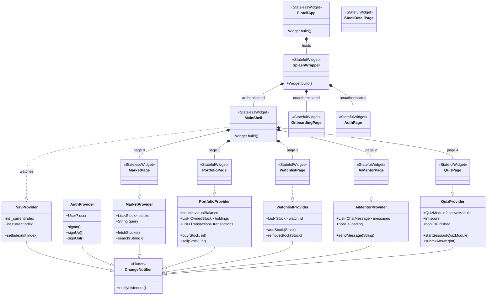

# Fintell — Financial Intelligence

A financial literacy mobile application built with Flutter. Fintell helps users learn about stock investing through a simulated portfolio, live market data, an AI-powered financial mentor, and interactive quizzes.

---

## Overview

Fintell is designed to lower the barrier to financial literacy for young adults. Users authenticate with Firebase, then interact with a feature-rich environment: reading real-time stock metrics, building a virtual portfolio tracked in Firestore, managing a watchlist, and testing their knowledge with gamified quizzes — all guided by a real AI mentor powered by Groq.

### Core Features

| Feature | Description |
|---|---|
| **Onboarding** | Multi-step onboarding flow shown to new/unauthenticated users |
| **Auth** | Sign in / Sign up with Firebase Authentication (email & password) |
| **Market** | Live-style stock data from Supabase — price, daily change, PE Ratio, ROE, volume |
| **Stock Detail** | Full stock deep-dive: chart, metrics, news, and buy/sell actions |
| **Portfolio** | Virtual balance, performance chart, holdings with unrealized gain/loss, transaction history |
| **Watchlist** | Save and monitor stocks by sector; backed by Firestore |
| **AI Mentor** | Real chat interface powered by Groq LLM — ask any financial question |
| **Quiz** | Gamified finance quizzes with modules, scoring, explanations, and a summary screen |

---

## Tech Stack

| Layer | Technology |
|---|---|
| Framework | Flutter 3.x (Material 3) |
| Language | Dart 3.x |
| State Management | Provider 6.x |
| Authentication | Firebase Auth |
| Cloud Database | Cloud Firestore |
| Storage (Images) | Supabase Storage |
| Market Data | Supabase (stock data) |
| AI Mentor | Groq API (via `http`) |
| Notifications | `flutter_local_notifications` |
| Font | Inter (via `google_fonts`) |
| Environment | `flutter_dotenv` |

---

## Project Structure

```
lib/
├── main.dart                              # App entry, providers, routing, shell navigation
├── firebase_options.dart                  # Auto-generated Firebase config
│
├── core/
│   ├── theme/
│   │   └── app_theme.dart                 # Global ThemeData (green/white, Inter font)
│   ├── dummy_data/
│   │   ├── app_data.dart                  # Static fallback data (stocks, goals, chat)
│   │   └── quiz_data.dart                 # All quiz questions & modules (static)
│   ├── models/
│   │   ├── chat_session.dart              # ChatSession & ChatMessage models
│   │   ├── quiz_models.dart               # Quiz domain models (Module, Question, etc.)
│   │   └── quiz_models_flutter_ext.dart   # Flutter extensions on quiz models
│   └── services/
│       ├── ai_mentor_service.dart         # Groq API integration for AI chat
│       ├── currency_service.dart          # IDR/USD conversion helpers
│       ├── market_service.dart            # Supabase stock data fetching
│       ├── notification_service.dart      # Local notification scheduling
│       ├── quiz_service.dart              # Quiz session management
│       └── storage_service.dart          # Supabase Storage (profile images)
│
├── shared/
│   └── providers/
│       ├── auth_provider.dart             # Firebase Auth state & user profile
│       ├── ai_mentor_provider.dart        # AI Mentor chat state
│       ├── market_provider.dart           # Stock list & search state
│       ├── nav_provider.dart              # Bottom navigation index state
│       ├── portfolio_provider.dart        # Portfolio, holdings & transactions
│       ├── quiz_provider.dart             # Quiz session & scoring state
│       └── watchlist_provider.dart        # Watchlist CRUD (Firestore-backed)
│
└── features/
    ├── auth/
    │   ├── auth_page.dart                 # Sign in / Sign up UI
    │   └── auth_service.dart              # Firebase Auth helper
    ├── splash/
    │   └── onboarding_page.dart           # Multi-step onboarding for new users
    ├── market/
    │   ├── market_page.dart               # Market index cards + stock list
    │   └── stock_detail_page.dart         # Full stock detail (chart, metrics, buy/sell)
    ├── portfolio/
    │   ├── portfolio_page.dart            # Balance card, chart, holdings list
    │   └── transaction_detail_page.dart   # Individual transaction detail
    ├── watchlist/
    │   └── watchlist_page.dart            # Tabbed watchlist by sector (Firestore)
    ├── ai_mentor/
    │   └── ai_mentor_page.dart            # Real AI chat UI (Groq-powered)
    └── quiz/
        ├── quiz_page.dart                 # Quiz entry point / module selector
        └── widgets/
            ├── quiz_modules_hub.dart      # Module grid with progress indicators
            ├── question_view.dart         # Active question UI
            ├── answer_option.dart         # Individual answer option widget
            ├── explanation_panel.dart     # Post-answer explanation panel
            ├── quiz_summary_view.dart     # End-of-quiz summary & score
            └── error_banner.dart          # Error state widget
```

---

## Screens

### Onboarding
A multi-step onboarding flow displayed to first-time or unauthenticated users, introducing the app's key features before prompting sign-up.

### Auth
Clean sign in and sign up screens backed by Firebase Authentication. Handles email/password flows with error feedback.

### Market
Displays market index cards, a search bar, and a scrollable list of stocks fetched from Supabase. Each tile shows ticker, name, price, daily change badge, PE Ratio, and ROE.

### Stock Detail
A full-screen deep-dive for any selected stock — includes a price chart, fundamental metrics, recent news, and buy/sell actions that update the user's virtual portfolio in Firestore.

### Portfolio
Shows the user's virtual portfolio sourced from Firestore. A gradient card at the top displays total balance, total invested, and total return. Below it, a performance line chart and a holdings list show each owned stock with shares, avg buy price, current value, and unrealized gain/loss. Tapping a holding opens the transaction detail view.

### Watchlist
A Firestore-backed, tabbed view across sector categories (Technology, Finance, Healthcare, etc.). Users can add/remove stocks, with state persisted to the cloud.

### AI Mentor
A modern real-time chat interface powered by the Groq LLM API. Users can ask any financial question and receive intelligent, contextual responses. Features a typing indicator and conversation history.

### Quiz
A gamified quiz hub showing finance learning modules (Stocks, Bonds, Crypto, etc.). Each module has a set of questions with multiple-choice answers, post-answer explanations, and a summary screen with score and badges.

---

## Getting Started

### Prerequisites

- Flutter SDK `>=3.0.0`
- Dart SDK `>=3.0.0`
- Android Studio / VS Code with Flutter extension
- A Firebase project with Authentication and Firestore enabled
- A Supabase project (for stock data and image storage)
- A Groq API key

### Environment Setup

Create a `.env` file in the project root (it is loaded via `flutter_dotenv` and declared as an asset in `pubspec.yaml`):

```env
GROQ_API_KEY=your_groq_api_key
SUPABASE_URL=https://your-project.supabase.co
SUPABASE_KEY=your_supabase_anon_key
```

### Run the App

```bash
# Install dependencies
flutter pub get

# Run on connected device or emulator
flutter run
```

### Analyze Code

```bash
flutter analyze
```

---

## Key Dependencies

| Package | Version | Purpose |
|---|---|---|
| `provider` | ^6.1.2 | State management |
| `firebase_core` | ^3.13.0 | Firebase initialization |
| `firebase_auth` | ^5.5.4 | User authentication |
| `cloud_firestore` | ^5.6.12 | Portfolio & watchlist persistence |
| `supabase_flutter` | ^2.15.0 | Market data & image storage |
| `google_fonts` | ^6.2.1 | Inter font |
| `http` | ^1.2.2 | Groq API calls |
| `flutter_dotenv` | ^5.2.1 | Environment variable loading |
| `flutter_local_notifications` | ^22.0.1 | Goal milestone notifications |
| `permission_handler` | ^12.0.3 | Notification permissions |
| `image_picker` | ^1.2.2 | Profile photo selection |
| `confetti` | ^0.8.0 | Quiz celebration animations |

---

## Class Diagram



---

## Design System

| Token | Value |
|---|---|
| Primary | `#10B981` (Emerald 500) |
| Primary Dark | `#059669` (Emerald 600) |
| Primary Light | `#D1FAE5` (Emerald 100) |
| Background | `#FFFFFF` |
| Surface | `#F9FAFB` |
| Text Primary | `#111827` |
| Text Secondary | `#6B7280` |
| Positive (green) | `#10B981` |
| Negative (red) | `#EF4444` |
| Font | Inter (Google Fonts) |

---