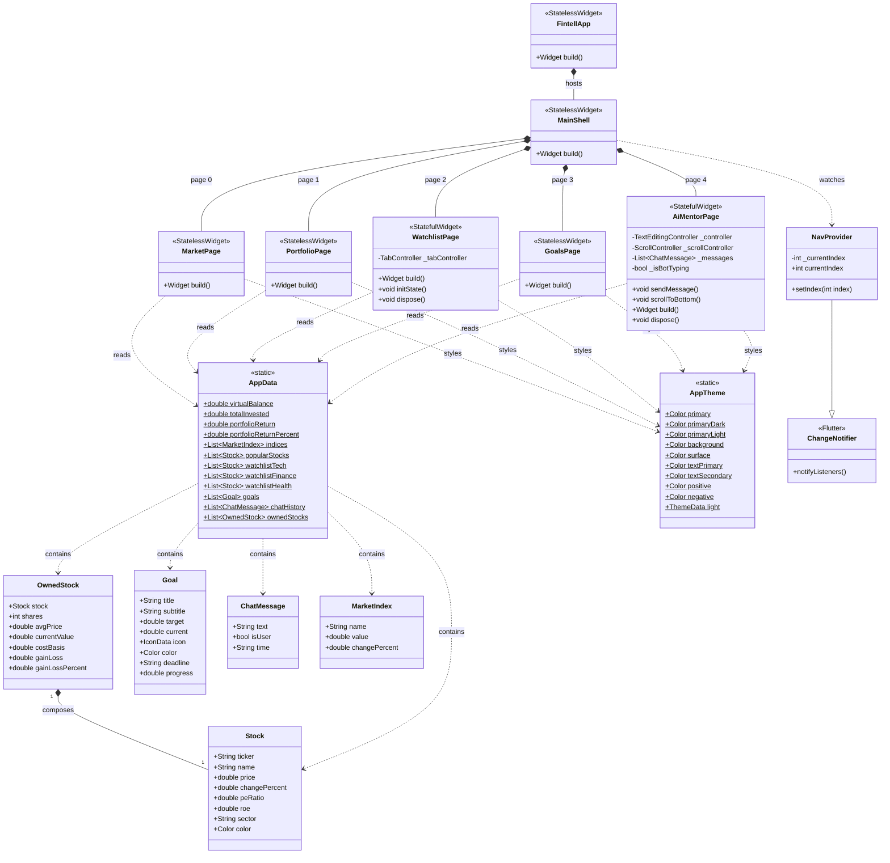

# Fintell — Financial Intelligence

A financial literacy mobile application built with Flutter. Fintell helps users learn about stock investing through a simulated portfolio, savings goal tracker, and an AI-powered financial mentor.

---

## Overview

Fintell is designed to lower the barrier to financial literacy for young adults. Instead of real money or live market data, users interact with a virtual environment that teaches the fundamentals of investing: reading stock metrics, building a portfolio, tracking savings goals, and asking questions to an AI mentor.

### Core Features

| Feature | Description |
|---|---|
| **Market** | Browse popular US stocks with live-style data — price, daily change, PE Ratio, and ROE |
| **Portfolio** | View your virtual balance, performance chart, and holdings with unrealized gain/loss |
| **Watchlist** | Save and monitor stocks by sector (Technology, Finance, Healthcare) |
| **Goals** | Track real-world savings targets with visual progress bars |
| **AI Mentor** | Chat interface for asking financial questions to the Fintell AI |

---

## Tech Stack

| Layer | Technology |
|---|---|
| Framework | Flutter 3.x (Material 3) |
| Language | Dart 3.x |
| State Management | Provider 6.x |
| Font | Inter (via `google_fonts`) |
| Data | Static dummy data (no backend) |

---

## Project Structure

```
lib/
├── main.dart                          # App entry point, theme, shell navigation
│
├── core/
│   ├── theme/
│   │   └── app_theme.dart             # Global ThemeData (green/white, Inter font)
│   └── dummy_data/
│       └── app_data.dart              # All static data: stocks, goals, chat history
│
├── shared/
│   └── providers/
│       └── nav_provider.dart          # ChangeNotifier for bottom navigation state
│
└── features/
    ├── market/
    │   └── market_page.dart           # Market index cards + stock list with metrics
    ├── portfolio/
    │   └── portfolio_page.dart        # Balance card, line chart, holdings list
    ├── watchlist/
    │   └── watchlist_page.dart        # TabBar with stock tiles per sector
    ├── goals/
    │   └── goals_page.dart            # Savings goal cards with progress bars
    └── ai_mentor/
        └── ai_mentor_page.dart        # Chat UI with typing indicator
```

---

## Screens

### Market
Displays a personalized greeting, a horizontal scroll of market index cards (S&P 500, NASDAQ, DOW), a search bar, and a scrollable list of 10 popular US stocks. Each stock tile shows the ticker, company name, current price, daily percentage change, PE Ratio, and ROE.

### Portfolio
Shows the user's virtual portfolio. A green gradient card at the top displays the total virtual balance ($52,450), total amount invested, and total return. Below it, a custom-painted line chart visualizes performance. A holdings list shows each owned stock with shares, average buy price, current value, and unrealized gain/loss.

### Watchlist
A tab-based view with three sector categories: Technology, Finance, and Healthcare. Each tab contains stock tiles with price, daily change badge, and fundamental metric tags (PE, ROE, sector).

### Goals
An overview banner shows total savings progress across all goals. Below it, individual goal cards show an icon, title, deadline, saved vs target amounts, a color-coded linear progress bar, and a "Done!" badge for completed goals.

### AI Mentor
A modern chat interface styled like a messaging app. Pre-loaded with a sample conversation covering PE Ratio, ROE, and stock analysis. Users can type new questions or tap suggested question chips. The bot responds with a canned reply and an animated three-dot typing indicator.

---

## Getting Started

### Prerequisites

- Flutter SDK `>=3.0.0`
- Dart SDK `>=3.0.0`
- Android Studio / VS Code with Flutter extension

### Run the App

```bash
# Install dependencies
flutter pub get

# Run on connected device or emulator
flutter run
```

### Analyze Code

```bash
flutter analyze
```

---

## Data Model

All data lives in `lib/core/dummy_data/app_data.dart`. Key classes:

| Class | Fields |
|---|---|
| `Stock` | ticker, name, price, changePercent, peRatio, roe, sector, color |
| `OwnedStock` | wraps `Stock` + shares + avgPrice; computes gain/loss automatically |
| `Goal` | title, subtitle, target, current, icon, color, deadline; computes progress (0.0–1.0) |
| `ChatMessage` | text, isUser flag, timestamp string |
| `MarketIndex` | name, value, changePercent |

---

## Class Diagram



---

## Design System

| Token | Value |
|---|---|
| Primary | `#10B981` (Emerald 500) |
| Primary Dark | `#059669` (Emerald 600) |
| Primary Light | `#D1FAE5` (Emerald 100) |
| Background | `#FFFFFF` |
| Surface | `#F9FAFB` |
| Text Primary | `#111827` |
| Text Secondary | `#6B7280` |
| Positive (green) | `#10B981` |
| Negative (red) | `#EF4444` |
| Font | Inter (Google Fonts) |

---

## Development Roadmap

### Stage 1 — UI Prototype (Current)
- [x] Feature-based folder structure
- [x] Material 3 theme (green/white, Inter font)
- [x] Bottom navigation with Provider
- [x] Market page with stock metrics
- [x] Portfolio page with custom line chart
- [x] Watchlist with sector tabs
- [x] Goals with progress tracking
- [x] AI Mentor chat interface

### Stage 2 — Backend Integration (Planned)
- [ ] Firebase Authentication
- [ ] Firestore for portfolio and goals persistence
- [ ] Live stock price API integration
- [ ] Real AI responses via LLM API

### Stage 3 — Final Polish (Planned)
- [ ] Onboarding flow
- [ ] Push notifications for goal milestones
- [ ] Dark mode support
- [ ] Charts with real historical data

---